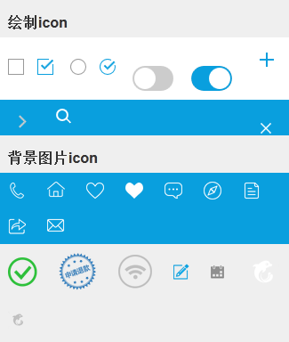

# webcomponent

对于支持shadow dom的浏览器，每个组件都有一个独立的样式，包括重置都是在内部进行，当然对于不支持的浏览器会自动降级

## class命名解释及参考

见[styleguide](styleguide.html)

## base

###reset

在normalize.css的基础上进行归零设置

### help class

`*{ -webkit-box-sizing: border-box; box-sizing: border-box; }`

```css
.fl { float: left; }
.fr { float: right; }
.fs12 { font-size: 12px; }
.grayc { color: #ccc; }
.gray9 { color: #999; }
.gray6 { color: #666; }
.p10 { padding: 10px; }
.plr10 { padding-left: 10px; padding-right: 10px; }
.mt10 { margin-top: 10px; }
.mb10 { margin-bottom: 10px; }
.mlr10 { margin-left: 10px; margin-right: 10px; }
.guide-title { margin: 10px 0 0 10px; font-weight: bold; font-size: 16px; }
.full-width { width: 100%; }
.justify { display: -webkit-box; display: -webkit-flex; display: -ms-flexbox; display: flex; -webkit-box-pack: justify; -webkit-justify-content: space-between; -ms-flex-pack: justify; justify-content: space-between; }
.cm-fixed{position: fixed;}
.cm-inline-block{display: inline-block;}
.cm-absolute{position: absolute;}
.cm-static{position: static !important;}
```

### btn

[查看 btn demo](webcomponent/btn.html)

#### 基本按钮

1. 考虑到btn使用的范围及频率比较高，所以设计的五个不同class的btn，分为为`.btn`,`.btn-primary`,`.btn-secondary`,`.btn-sub`,`.btn-link`，可单独使用互不依赖，因为移动端的点击范围所限，所以这基础的五个都是一样大的高度44px（即header条的高度）,如禁用则添加`.disabled`

2. 100%宽度的btn追加class`.full-width`

3. `.btns-group>span.btn`简单的按钮组，中间以横线隔开

4. `.btns-seperate-group>span.btn*n`分离按钮组，每个按钮单独

#### actions按钮

为弹窗设计的按钮，一般在弹出内容的ft部分，基本结构为`.cm-actions>span.cm-actions-btn*n`，采用table布局，水平等分，若需每个btn单行垂直排列，在`.cm-actions`上追加`.cm-actions--full`，采用block布局，具体请参考alert和modal部分应用

### icons

[查看 icon demo](webcomponent/icon.html)

icons分为两种，一种是css绘制的，一种是背景图片的，目前提供的icons如下：



### form

[查看 form demo](webcomponent/form.html)

#### 基本结构，有label

```html
<div class="form-item">
    <label class="field-label">Email</label>
    <input type="text" class="field-text">
</div>
```

默认左边label文字占用90px，与左边偏移10px，然后input占据剩余的所有宽度

#### 右侧有箭头

这里箭头分为两种：一种是没有输入框的整行可点击跳转的（使用.form-item--arrow，箭头通过伪元素生成），另一种是有输入框的只能点击箭头的跳转的（使用.form-item--arrow-btn，箭头通过i.icon-arrow生成）。

**带输入框跳转的**

```html
<div class="form-item form-item--arrow-btn">
    <label class="field-label">入住人</label>
    <input type="text" placeholder="输入入住人姓名" class="field-text">
    <i class="icon-arrow"></i>
</div>
```
在`.form-item`上追加`.form-item--arrow-btn`,并在里面添加箭头icon`i.icon-arrow`。这里我们使用了`i.icon-arrow`来负责箭头，而不是使用`::after`伪元素，是因为这里点击绑定的不是整行，而是那个箭头

**右侧有文字和箭头**

```html
<div class="form-item form-item--arrow">
    <label class="field-label">到店时间</label>
    <span class="fr">20:00之前</span>
</div>
```

`.form-item--arrow`通过`::after`伪类生成箭头，`.fr`负责右边文字

**不带输入框跳转的，值**

```html
<div class="form-item form-item--arrow">
    <label class="field-label">价格</label>
    <span class="field-value">不限</span>
</div>
```

值为`span.field-value`

#### 无label

```html
<div class="form-item form-item--no-label">
    <input type="text" class="field-text">
</div>

<form class="form form--no-label">
	<div class="form-item">
	    <input type="text" class="field-text">
	</div>
</form>
```
一种是通过对`.form-item`追加`.form-item--no-label`来实现，另一种是直接在父元素form上添加`.form--no-label`来控制`.form-item`

#### textarea

定义了一个`.textarea`宽度为100%，高度为80px，padding为10px


## animate

考虑到动画作为修饰的一部分，可根据实际情况判断是否需要动画效果。所以动画采用keyframes动画，而非transition动画。

默认设计了3组动画`cm-fade-in/out`,`cm-up-in/out`,`cm-down-in/out`，每种动画以in和out成对出现，动画时间为0.3s

上面的三组动画都涉及到了transform属性，所以请注意需要添加动画的元素是否已经有了transform属性，防止被覆盖。

### fade in/out

动画涉及属性transform的scale和opacity。

```css
@keyframes fadeIn {
    0% {
        opacity: 0;
        transform: scale(0.815);
    }
    100% {
        opacity: 1;
        transform: scale(1);
    }
}

@keyframes fadeOut {
    0% {
        opacity: 1;
        transform: scale(1);
    }
    100% {
        opacity: 0;
        transform: scale(1.185); 
    }
}
```

### down in/out

动画涉及属性transform的translate的opacity

适合于pop page这种整屏弹出，或从底部弹出的一些特效如筛选选项

```css
@keyframes downIn {
    0% {
        opacity: 0;
        transform: translate3d(0, 100%, 0);
    }
    100% {
        opacity: 1;
        transform: translate3d(0, 0, 0);
    }
}

@keyframes downOut {
    0% {
        opacity: 1;
        transform: translate3d(0, 0, 0);
    }
    100% {
        opacity: 0;
        transform: translate3d(0, 100%, 0);
    }
}
```

### up in/out

动画涉及属性transform的translate和opacity


```css
@keyframes upIn {
    0% {
        opacity: 0;
        transform: translate3d(0, -100%, 0);
    }
    100% {
        opacity: 1;
        transform: translate3d(0, 0, 0);
    }
}

@keyframes upOut {
    0% {
        opacity: 1;
        transform: translate3d(0, 0, 0);
    }
    100% {
        opacity: 0;
        transform: translate3d(0, -100%, 0);
    }
}
```

## header

[查看 header demo](webcomponent/header.html)

```html
<header class="cm-header">
    <span class="icon-back fl cm-header-icon"></span>
    <span class="fr cm-header-icon"><i class="icon-list"></i></span>
    <h1 class="cm-page-title">页面标题太长会...</h1>
</header>
```

* 标题为h1标签：`.cm-page-title`单行超过截断；`.cm-page-mutil-title`两行；`.cm-page-title>span.cm-title-l+span.scm-title-s`大小标题；`.cm-page-tabs-title>span.active+span`tabs标题；`.cm-page-select-title`选择标题
*  `.fl`,`.fr`左右两边icon采用浮动布局，注意如果右侧icon比较多，采用一个个罗列的话其icon出现顺序与代码中刚好相反，可以参考header的demo，右侧有两个图标的，当然你也可以把所有的图片包裹在一个`.fr`的容器中，那样顺序就是ok的
* `.cm-header-icon`为icon的正方形点击区域，大小为header的高度
* `.cm-header-btn`为文字信息的btn，左右padding为10px，高度为header的高度


## group list

[查看 group list demo](webcomponent/group-list.html)

```html
<div class="cm-group-list">
	<div class="cm-group-item">    
		<div class="cm-group-hd"></div>
	    <div class="cm-group-bd">
	        <ul class="cm-radio-list">
	            <li>北京</li>
	            <li class="checked">上海</li>
	        </ul>
	    </div>
	</div>
	<div class="cm-group-item expaned">
	    <div class="cm-group-hd"></div>
	    <div class="cm-group-bd">
	        <ul class="cm-radio-list">
	            <li>广州</li>
	            <li>深圳</li>
	        </ul>
	    </div>
	</div>
	...
</div>
```

hd表示可点击的标题部分，bd表示可折叠的内容部分。bd的显示或隐藏状态由`.cm-group-item`决定，默认隐藏，追加class`.expanded`表示展开。

## loading

[查看 loading demo](webcomponent/loading.html)

```html
/* 默认无关闭按钮*/
<section class="cm-loading">
    <span class="icon-loading"><i class="icon-loading-circle"></i></span>
</section>

/* 有关闭按钮*/
<section class="cm-loading cm-loading--close">
    <span class="icon-loading"><i class="icon-loading-circle"></i></span>
	<i class="icon-close"></i>
</section>

/* 有关闭按钮及文字描述*/
<section class="cm-loading cm-loading--close">
    <span class="icon-loading"><i class="icon-loading-circle"></i></span>
	<p class="cm-loading-text">提交中...</p>
	<i class="icon-close"></i>
</section>
```

`.icon-loading`所用的背景为logo，旋转的为`.icon-loading-circle`


## modal

[查看 modal demo](webcomponent/modal.html)

### 基本结构

```html
<section class="cm-modal">
    <header class="cm-modal-hd">
        <h3 class="cm-modal-title">浮层标题</h3>
        <i class="icon-close"></i>
    </header>
    <div class="cm-modal-bd">
        <p>浮层内容</p>
    </div>
	<footer class="cm-modal-ft"></footer>
</section>
```

1. hd部分默认文字居左，右侧有关闭按钮`i.icon-close`，背景色为主色调蓝色，如没有则去掉
2. 若背景色为白色，则在`.cm-modal-hd`追加`.cm-modal-hd--tint`
3. 若文字居中且右侧无关闭按钮，则在`.cm-modal-hd`追加`.cm-modal-hd--center`，并去掉关闭按钮`i.icon-close`
4. 默认bd部分无内边距，如需要可以添加常用class`.p10`或`.plr10`
5. ft部分如没有则去掉


### bd为选择操作

```html
<section class="cm-modal">
    <header class="cm-modal-hd cm-modal-hd--center">
        <h3 class="cm-modal-title">菜单标题</h3>
    </header>
    <div class="cm-modal-bd">
        <ul class="cm-radio-list">
            <li class="active">选项一</li>
            <li>选项二</li>
            <li>选项三</li>
        </ul> 
    </div>
</section>
```

`.cm-radio-list`为单选的选择操作，如果为多选项则使用`.cm-checkbox-list`

```html
<ul class="cm-checkbox-list">
    <li class="active"><i class="icon-checkbox"></i>选项一</li>
    <li><i class="icon-checkbox"></i>选项二</li>
    <li><i class="icon-checkbox"></i>选项三</li>
</ul>
```

注意，单选的图标是用伪元素生成的，而多选的图标采用`i.icon-checkbox`

### footer为执行按钮

若ft部分为按钮操作，则为`.cm-modal-ft`追加`.cm-actions`

```html
<section class="cm-modal">
    <header class="cm-modal-hd">
        <h3 class="cm-modal-title">浮层标题</h3>
        <i class="icon-close"></i>
    </header>
    <div class="cm-modal-bd p10">
        <p>浮层内容</p>
    </div>
	<footer class="cm-modal-ft cm-actions">
        <span class="cm-actions-btn">取消</span>
        <span class="cm-actions-btn">确定</span>
    </footer>
</section>
```

### 全部为执行按钮

```html
<section class="cm-modal cm-modal--action">
    <div class="cm-modal-bd">
        <ul class="cm-actions cm-actions--full">
            <li class="cm-actions-btn">操作1</li>
            <li class="cm-actions-btn">操作2</li>
            <li class="cm-actions-btn">操作3</li>
        </ul>
    </div>
    <footer class="cm-modal-ft cm-actions">
        <span class="cm-actions-btn">取消</span>      
    </footer>
</section>
```

在`.cm-modal`上追加`.cm-modal--action`，执行按钮组则为`.cm-actions.cm-actions--full>.cm-actions-btn*n`

## alert

[查看 alert demo](webcomponent/alert.html)

本组件模拟pc端的alert弹窗，作为modal的一个特殊形式，在`.cm-modal`上追加class`.cm-modal--alert`，没有hd部分包括右上角的关闭按钮，下面有执行按钮，一般为取消或确认，如不满足该两条特点请不要使用该结构，直接使用modal结构。

## 基本结构

```html
<section class="cm-modal cm-modal--alert">
    <div class="cm-modal-bd">
        <p>提示文案</p>
    </div>
    <footer class="cm-actions">
        <span class="cm-actions-btn">取消操作</span>
        <span class="cm-actions-btn">执行操作</span>
    </footer>
</section>
```

默认内容居中，下面的按钮平分间距。若内容有多行，则使用`.cm-mutil-lines`，若有标题则在bd中添加`h3.cm-alert-title`,若执行按钮每个独自一行则在`.cm-actions`上追加class`.cm-actions--full`，如有其它要求，请考虑直接使用`.cm-modal`

## toast

[查看 toast demo](webcomponent/toast.html)

同样作为modal的一种特殊形式

```html
<section class="cm-modal cm-modal--toast">
    <div class="cm-mod-bd">
		<p>网络连接超时，请稍后重试</p>
	</div>
</section>
```

## id card

[查看 id card demo](webcomponent/id-card.html)

modal的一种特殊形式

```html
<section class="cm-modal cm-modal--num-keyboard">
    <div class="cm-modal-bd">
        <div class="cm-keyboard-bar"><span class="btn-secondary">完成</span></div>
        <ul class="cm-keyboard-list">
            <li class="item-num">1</li>
            <li class="item-num">2</li>
            <li class="item-num">3</li>
            <li class="item-num">4</li>
            <li class="item-num">5</li>
            <li class="item-num">6</li>
            <li class="item-num">7</li>
            <li class="item-num">8</li>
            <li class="item-num">9</li>
            <li class="item-num">X</li>
            <li class="item-num">0</li>
            <li class="item-del"><span class="icon-del"><i class="icon-close"></i></span></li>
        </ul>
    </div>
</section>
```

## pop

[查看 pop demo](webcomponent/pop.html)

### 基础结构

```html
<section class="cm-pop">
    <i class="icon-pop-triangle"></i>
    <div class="cm-pop-bd">
        <p>pop内容</p>
    </div>
</section>
```

三角箭头采用`.icon-pop-triangle`所画，如无三角则去掉该标签即可。默认箭头朝下，没有提供左右箭头，如需朝上，可在`.cm-pop`上追加class`.cm-pop--triangle-up`。如pop有边框则追加class`.cm-pop--border`，如是圆角则可追加class`.cm-pop--radius`

### pop list

```html
<section style="width:120px" class="cm-pop cm-pop--border">
    <i class="icon-pop-triangle"></i>
    <div class="cm-pop-bd">
        <ul class="cm-pop-list">
            <li>价格/星级</li>
            <li class="active">位置区域</li>
            <li>品牌</li>
            <li>测试</li>
        </ul>
    </div>
</section>
```

### 全局用户导航

[查看 user nav demo](webcomponent/user-nav.html)

pop的一种特例，箭头朝上，在`.cm-pop`上追加`.cm-pop--triangle-up.cm-pop--user-nav`

```html
<section class="cm-pop cm-pop--triangle-up cm-pop--user-nav">
    <i class="icon-pop-triangle"></i>
    <div class="cm-pop-bd">
	    <ul class="cm-user-nav">
	        <li><i class="icon-share"></i>分享</li>
	        <li><i class="icon-comment"></i>预约咨询</li>
	        <li><i class="icon-phone"></i>联系携程</li>
	        <li><i class="icon-compass"></i>团队助手</li>
	        <li><i class="icon-file"></i>我的订单</li>
	        <li><i class="icon-love"></i>我的收藏</li>
	        <li><i class="icon-email"></i>消息中心</li>
	        <li><i class="icon-home"></i>携程首页</li>
	    </ul>
    </div>
</section>
```

## slide

[查看 slide demo](webcomponent/slide.html)

```html
<div class='cm-slide'>
    <div class="cm-slide-view">
        <ul class="cm-slide-list">
            <li class="cm-slide-item"></li>
            <li class="cm-slide-item"></li>
            <li class="cm-slide-item"></li>
            <li class="cm-slide-item"></li>
        </ul>
    </div>
    <nav class="cm-slide-bullet"><i class="cm-bullet-item active"></i><i class="cm-bullet-item"></i><i class="cm-bullet-item"></i><i class="cm-bullet-item"></i><i class="cm-bullet-item"></i></nav>
</div>
```

`.cm-slide-view`图片展示区域，`.cm-slide-bullet`子弹导航区域，默认没有对img添加任何样式，如需img为全屏则追加class'.cm-slide--full-img'


## tabs

[查看 tabs demo](webcomponent/tabs.html)

```html
<div class="cm-tabs">
    <nav class="cm-tabs-nav">
        <ul class="cm-tabs-title-list">
            <li class="active">选项1</li>
            <li>选项2</li>
        </ul>
        <i class="icon-active"></i>
    </nav>
    <div class="cm-tabs-content-wrap">
        <div class="cm-tabs-content">内容一</div>
        <div class="cm-tabs-content">内容二</div>
    </div>
</div>
```

`i.icon-active`表示滑动的高亮条，因为选项标题等分问题（flex可能不兼容，这里采用table来实现等分），所以多嵌套了一层。`.cm-tabs-content-wrap`是包裹层，可以根据实际需要添加或去掉

## rate

[查看 rate demo](webcomponent/rate.html)

一般有两种类型rate：一种用来让用户点评的，有动态js交互行为；一种是用来展示所有的点评结果的，无动态js交互行为。为了统一，我们这里统一采用一种结构。

```html
<div class="cm-rate">
	<div class="cm-rate-view">
		<i class="icon-rate" style="width:80%"></i>
	</div>
	<p class="cm-rate-info"></p>
</div>
```

动态js交互行为，由`.cm-rate-info`显示用户的评价对应的说明，如果是静态的展示点评结果，则可以去掉外层包裹`.cm-rate`及`.cm-rate-info`，只有`.cm-rate-view`

几颗星由`i.icon-rate`的宽度决定，每隔20%表示一颗星，每隔10%表示半颗星

## num adjust

[查看 num adjust demo](webcomponent/num-adjust.html)

用于数字微调

```html
<div class="cm-num-adjust">
    <span class="cm-adjust-minus disabled"></span>
    <span class="cm-adjust-view">0</span>
    <span class="cm-adjust-plus"></span>
</div>
```

加或减不可用时，追加`.disabled`，若中间的数字`.cm-adjust-view`可以输入的话，则设置其`contenteditable`属性为true

## scroll select 滚动选择

[查看 scroll select demo](webcomponent/scroll-select.html)

```html
<div class="cm-scroll-select">
    <ul class="cm-select-list">
        <li>上海</li>
        <li>北京</li>
        <li class="active">深圳</li>
        <li>广州</li>
        <li>杭州</li>
    </ul>
    <div class="cm-select-mask"></div>
</div>
```

遮罩及中间选中的间隔线都由`.cm-select-mask`完成。每个scroll select是一个单独的shadow dom，如果有多个select并列，如时间选择，生日选择，则使用嵌套，如下：

```html
<div class="cm-scroll-select-group">
    <div class="cm-scroll-select-wrap">
        <div class="cm-scroll-select">
            <ul class="cm-select-list">
                <li>8月</li>
                <li>9月</li>
                <li class="active">10月</li>
                <li>11月</li>
                <li>12月</li>
            </ul>
            <div class="cm-select-mask"></div>
        </div>
    </div>
    <div class="cm-scroll-select-wrap">
        <div class="cm-scroll-select">
            <ul class="cm-select-list">
                <li>5日</li>
                <li>6日</li>
                <li class="active">7日</li>
                <li>8日</li>
                <li>9日</li>
            </ul>
            <div class="cm-select-mask"></div>
        </div>
    </div>
</div>
<p class="cm-scroll-select-tips">提示信息</p>
```

`.cm-scroll-select`的shadow dom外层使用`.cm-scroll-select-wrap`嵌套，如有提示信息则使用`.cm-scroll-select-tips`

## birthday

[查看 birthday demo](webcomponent/birthday.html)

modal无hd，bd中的内容为cm-scroll-select

```html
<section class="cm-modal">
    <div class="cm-modal-bd plr10">
        <div class="cm-scroll-select-group cm-scroll-select-group--birthday">
            <h3>请选择出生日期</h3>
            <div class="cm-scroll-select-wrap">
                <div class="cm-scroll-select">
                    <ul class="cm-select-list">
                        <li>1986年</li>
                        <li>1987年</li>
                        <li class="active">1988年</li>
                        <li>1989年</li>
                        <li>1990年</li>
                    </ul>
                </div>
            </div>
            <div class="cm-scroll-select-wrap">
                <div class="cm-scroll-select">
                    <ul class="cm-select-list">
                        <li>8月</li>
                        <li>9月</li>
                        <li class="active">10月</li>
                        <li>11月</li>
                        <li>12月</li>
                    </ul>
                </div>
            </div>
            <div class="cm-scroll-select-wrap">
                <div class="cm-scroll-select">
                    <ul class="cm-select-list">
                        <li>21月</li>
                        <li>22月</li>
                        <li class="active">23月</li>
                        <li>24月</li>
                        <li>25月</li>
                    </ul>
                </div>
            </div>
        </div>
    </div>
    <footer class="cm-modal-ft cm-actions">
        <span class="cm-actions-btn">取消</span>
        <span class="cm-actions-btn">确定</span>
    </footer>   
</section>
```

## calendar

[查看 calendar demo](webcomponent/calendar.html)

```html
<div class="cm-calendar">
    <ul class="cm-calendar-hd">
        <li>日</li>
        <li>一</li>
        <li>二</li>
        <li>三</li>
        <li>四</li>
        <li>五</li>
        <li>六</li>
    </ul>
    <div class="cm-calendar-bd">
        <h3 class="cm-month">2014年09月</h3>
        <ul class="cm-day-list">
            <li class="cm-item--disabled"></li>
            <li class="cm-item--disabled"><p class="cm-field-title">1</p></li>
            <li class="cm-item--disabled"><p class="cm-field-title">2</p></li>
            <li class="cm-item--disabled"><p class="cm-field-title cm-field-title--holiday">3</p></li>
            <li><p class="cm-field-title">今天</p><p class="cm-field-label">入住</p></li>
            <li><p class="cm-field-title">明天</p></li>
            <li><p class="cm-field-title cm-field-title--holiday">后天</p></li>

            <li><p class="cm-field-title cm-field-title--holiday">7</p></li>
            <li><p class="cm-field-title cm-field-title--holiday">中秋节</p></li>
            <li><p class="cm-field-title">9</p></li>
            <li><p class="cm-field-title cm-field-title--festival">教师节</p></li>
        </ul>
		...
    </div>
    <div class="cm-calendar-ft">
        <ul class="cm-calendar-quick-nav">
            <li class="active">今天</li>
            <li>中秋</li>
            <li>国庆</li>
            <li>元旦</li>
            <li>除夕</li>
        </ul>
    </div>
</div>


<!-- 点击的tips -->
<section class="cm-calendar-tips">
    <div class="cm-tips-day">
       <p class="cm-tips-day-title">14</p>
       <p class="cm-tips-day-price">¥999</p>
       <p class="cm-tips-day-label">成团</p>
    </div>
</section>
```

常规日历整体分为三个部分：一个是固定的header星期部分，一个是可以滚动的具体日历（包括月份标题及每月的day列表），最后一个是底部的节日快键定位。除此之外还有个点击时候的tips部分，显示点击那个日期的信息

**day状态**

* 每个day可能有三个东西title,price,label
* 节日：放假的节日在title上添加class`.cm-field-title--holiday`，不放假的节日添加的class为`.cm-field-title--festival`（注：节日标题最长不得超过3个字）
* 特价：在price上追加class`.cm-field-price--sale`
* 周六周日：这个通过css3的选择器nth-of-type来实现（注：ios8对nth-child支持出现bug，所以使用nth-of-type比较靠谱）
* 激活状态：li添加class`.active`
* 不可选状态：灰字，li添加class`.cm-item--disabled`
* 时间段（如返程）：li上添加class`.cm-item--multi`